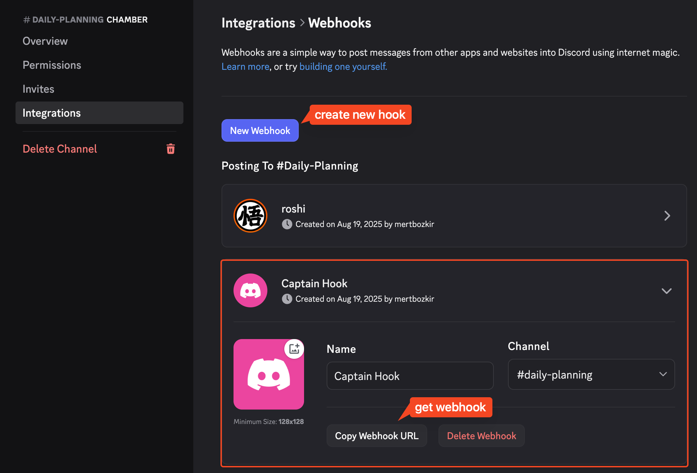
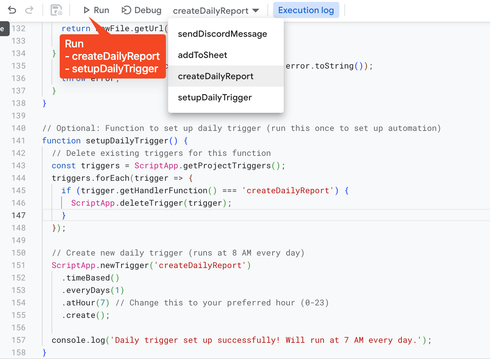
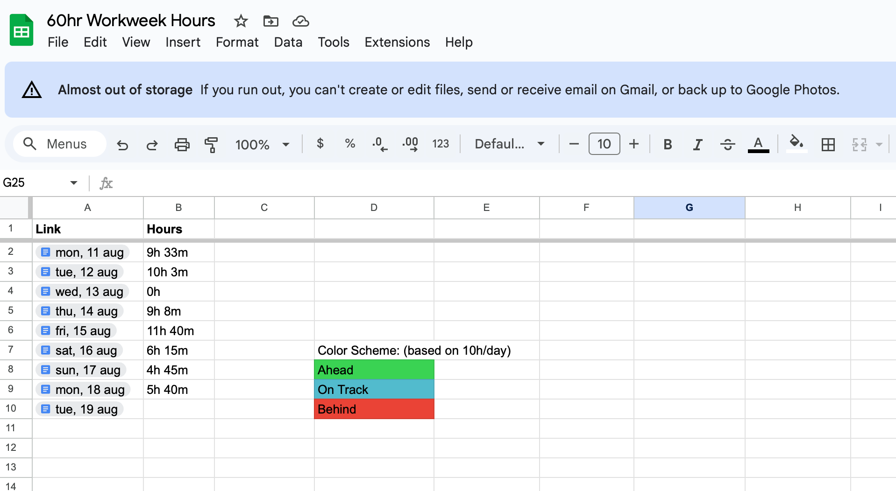
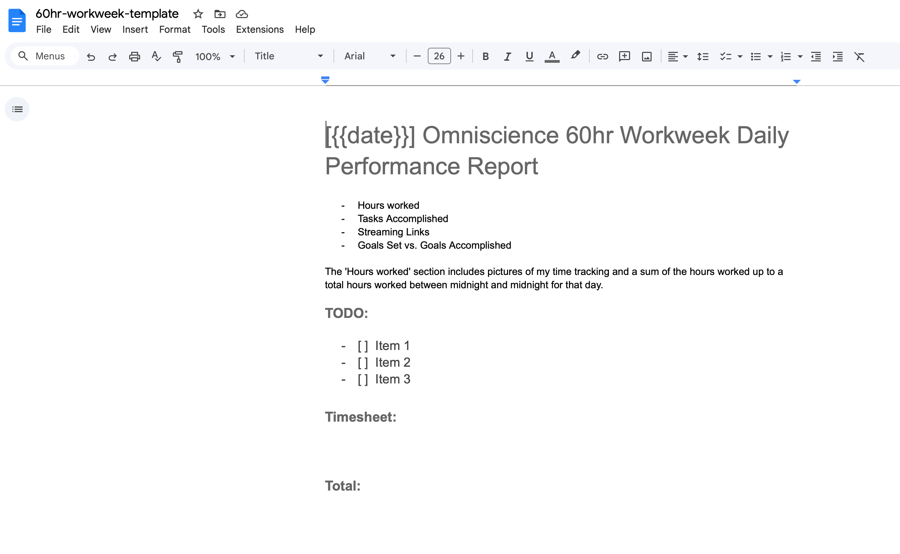
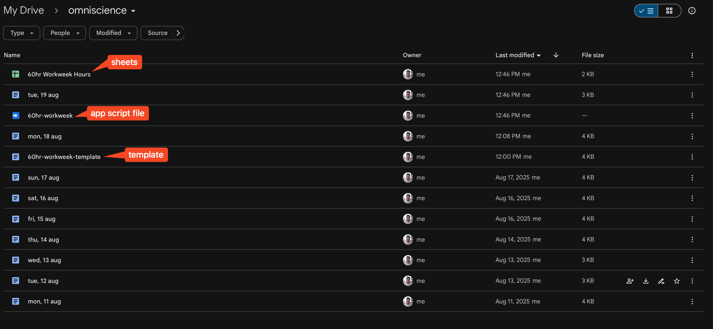
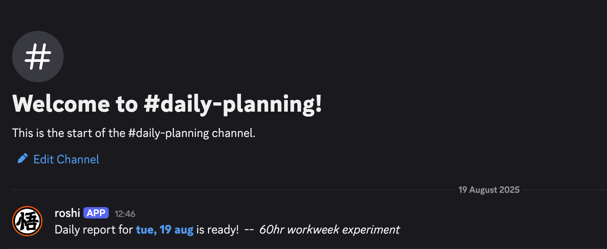
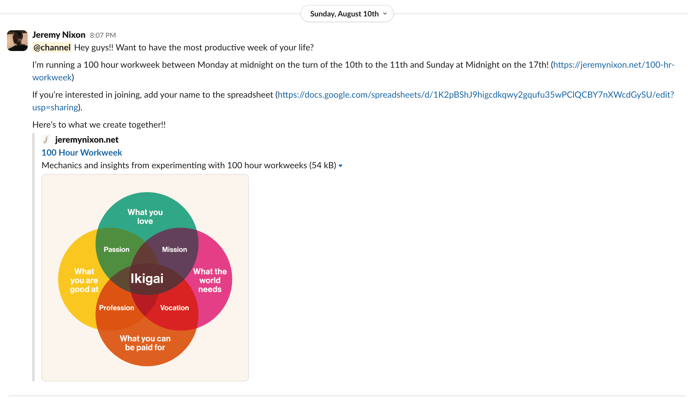

# 60hr Workweek Report Bot

This Google Apps Script automates your daily work report process. It:
- Copies a report-template from omniscience folder.
- Creates a daily report with name format: tue, 19 aug
- Adds this format to the workweek sheet as chip!
- Sends a message to your discord channel with webhook.

### To reproduce this:
- Take a webhook url for discord. (Edit Channel)

- Go to the [Apps Script](https://script.google.com/home)
- Create a new project. copy/paste the script 
- Copy/paste both templates: doc template, sheet template
- Run the script

#### Workweek Hours sheet:

Here's my [template](https://docs.google.com/spreadsheets/d/1Z_GBL3vEeEv7xmMpiyJqGBoOGWvWEy4VbP29kOcBEeM/edit?usp=sharing)

#### Template:
 
Here's my [template](https://docs.google.com/document/d/1lYHkUO-hr16jjtlyoGZMr5rnvDKHpVBhCVSAzf5shwM/edit?usp=sharing), here's Jeremy's [template](https://jeremynixon.net/100-hr-workweek#:~:text=Daily%20Performance%20Report)

#### Drive directory will look like this:

#### Discord message:

## Inspiration
Inspired by [Jeremy Nixon](https://x.com/jvnixon). [100 Hour Workweek](https://jeremynixon.net/100-hr-workweek)

Another resource he shared during the 100hr workweek challenge: [The 120-Hour Workweek - Epic Coding Time-Lapse](https://www.nickwinter.net/posts/the-120-hour-workweek-epic-coding-time-lapse)

### My result for 100hr workweek. (11 aug, 17 aug)

- Mon: 9h 33m
- Tue: 10h 3m
- Wed: 0h
- Thu: 9h 8m
- Fri: 11h 40m
- Sat: 6h 15m
- Sun: 4h 45m

Total: 51h 24m (❌ failed, barely passed half of it 🙂)